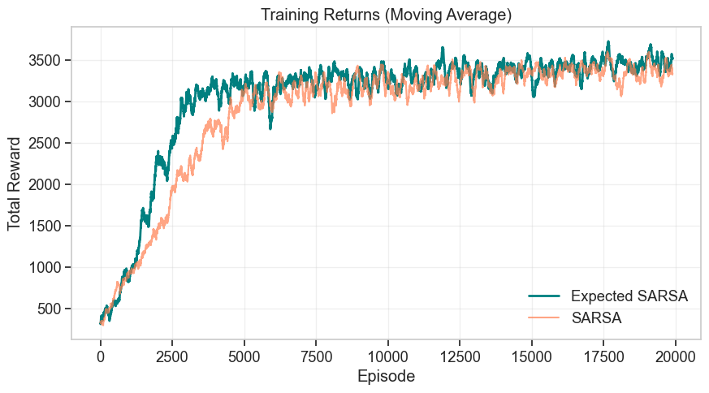
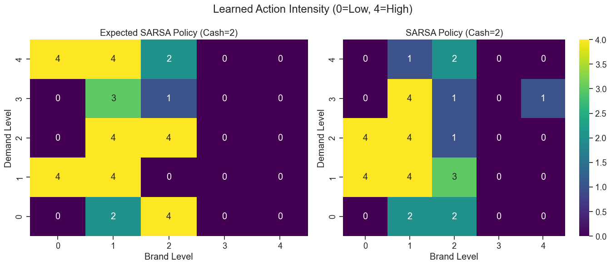

# Marketing Budget Optimization via Reinforcement Learning

## Overview
Optimizing marketing spend over time is a dynamic decision problem involving uncertainty. A business must continuously decide how much to invest in marketing while balancing:

1. Demand generation (short-term revenue)
2. Brand equity (long-term health)
3. Cash flow (spending discipline)

This project models marketing strategy as a Markov Decision Process (MDP) and applies reinforcement learning (RL) methods to learn a profitable long-term policy.

We compare two RL control methods:

- SARSA  
- Expected SARSA  

Expected SARSA typically learns faster and more stably, making it attractive for noisy business environments.

---

## MDP Formulation

### State Space
Each state is represented as a triple:

`(demand_level, brand_level, cash_level)`

Each level ranges from 0 to 4, giving 125 possible states.

### Action Space
Five marketing spend intensities:

| Action | Spending Interpretation |
|--------|--------------------------|
| 0      | No spend                |
| 1      | Low spend               |
| 2      | Medium spend            |
| 3      | High spend              |
| 4      | Very high spend         |

### Reward
Reward is modeled as:

`revenue(demand, brand) – cost(action)`

Where revenue increases with demand and brand strength, and costs increase with higher marketing intensity.

### Transition Dynamics
Demand and brand rise or fall based on spending, natural decay, and random noise.  
Cash is updated based on profit.  
The environment is stochastic to reflect real-world uncertainty.

---

## Algorithms Implemented

### TD(0) Prediction
Evaluates the value of a fixed, simple marketing strategy to provide a baseline.

### SARSA (On-Policy Control)
Learns the action-value function Q(s, a) by following an epsilon-greedy policy and updating based on the **sampled** next action.

### Expected SARSA (On-Policy, Lower-Variance Control)
Uses the same policy as SARSA, but updates based on the **expected** value over all possible next actions, weighted by the epsilon-greedy probabilities.

This reduces update noise and generally leads to more stable learning.

---

## Results

### 1. Learning Performance

Below are the moving-average returns for SARSA and Expected SARSA over 20,000 episodes:

#### Key Insights
- Expected SARSA converges faster and more smoothly.
- Its learning curve shows lower variance because it uses expected updates instead of sampled ones.
- Both algorithms eventually reach similar performance, but Expected SARSA stabilizes at a slightly higher reward level.
- SARSA fluctuates more during learning due to its reliance on single sampled next-actions.

In a noisy financial environment, smoother updates are a major practical advantage.

---

### 2. Learned Marketing Policies

The following heatmaps show the best marketing action learned by each algorithm for every combination of demand and brand levels, while cash level is fixed at 2.

A value of 0 on the heatmap means “do not spend,” while 4 means “spend the most.”

#### Expected SARSA Policy
- Displays a very **clean and structured strategy**.
- Recommends aggressive spending (action 4) when both demand and brand are high.
- Acts conservatively when demand is low.
- Produces consistent, smooth policy regions — ideal for decision support.

#### SARSA Policy
- Follows similar general patterns but is noticeably **more irregular and patchy**.
- Contains isolated inconsistent actions (e.g., unexpected moderate spending next to high-spend regions).
- Reflects the higher variance of the underlying update rule.

#### Interpretation
Expected SARSA’s policy is more stable and easier to interpret, which is valuable for real business use cases where clarity and consistency matter.

---

## Conclusion

This project demonstrates that:

- Reinforcement Learning can discover nuanced marketing strategies that balance profit, growth, and financial risk.
- Expected SARSA provides **faster learning, lower variance, and more interpretable policies** compared to SARSA.
- The learned strategies align with business intuition:
  - Spend aggressively when demand and brand are strong.
  - Spend cautiously when market conditions are weak.
  - Avoid wasteful spending when cash is low.

---

## Notebook

Full implementation and analysis are available in:

` Marketing_Optimization_RL.ipynb`